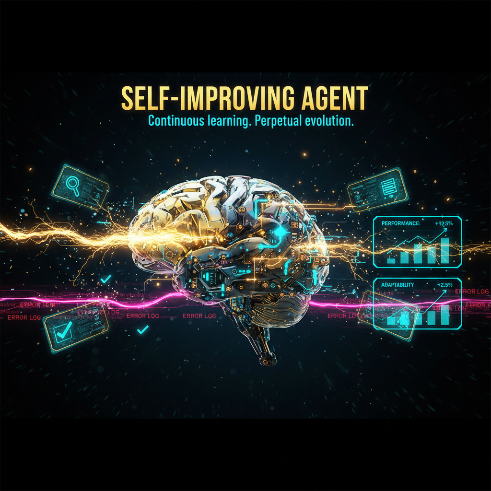

<p align="center">
  
</p>

<p align="center">
  <a href="https://github.com/DeontewattsV1/self-improving-agent/actions/workflows/ci.yml">
    
  </a>
  
  
</p>

<h1 align="center">Self-Improving Agent</h1>
<p align="center"><strong>Continuous learning. Perpetual evolution.</strong></p>

---

## What this is

A skill-based framework that enables AI agents to **capture learnings, track errors, and evolve continuously**. Designed to be dropped into any agent workspace.

### How it works

| Situation | Action |
|:---|:---|
| Command fails unexpectedly | Log to `.learnings/ERRORS.md` |
| User corrects you | Log to `.learnings/LEARNINGS.md` (category: correction) |
| Feature request identified | Log to `.learnings/FEATURE_REQUESTS.md` |
| API/tool fails | Log error with integration details |
| Better approach found | Log with category: best_practice |

### Structure

```
.learnings/
  ERRORS.md           # Error log with context and fixes
  LEARNINGS.md        # Corrections, knowledge gaps, best practices
  FEATURE_REQUESTS.md # Capability gaps to build

hooks/openclaw/
  handler.js          # OpenClaw integration hook
  handler.ts          # TypeScript version

scripts/
  activator.sh        # Activate the skill
  error-detector.sh   # Automatic error detection
  extract-skill.sh    # Extract patterns into reusable skills

SKILL.md              # Skill manifest & usage guide
```

### Installation

Drop into your agent workspace:

```bash
cp -r .learnings/ /path/to/agent/workspace/
cp SKILL.md /path/to/agent/workspace/.agents/skills/self-improvement.md
```

---

## Related Projects

- [Ethos-Aegis-](https://github.com/DeontewattsV1/Ethos-Aegis-) -- Sovereign AI Immune Architecture
- [Linguistic-Encryption-System-Celestial-](https://github.com/DeontewattsV1/Linguistic-Encryption-System-Celestial-) -- Evidence-bounded sovereign AI runtime

---

MIT (c) [GoodShyt Group](https://github.com/DeontewattsV1)